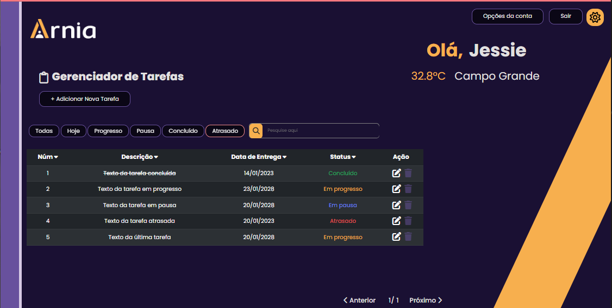
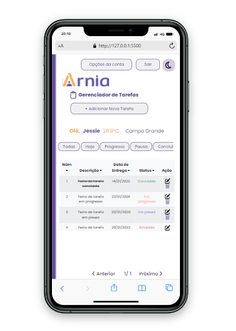

# Arnia Task Manager ⏰📋📌



**Project Name:** Arnia Task Manager ⏰📋📌  
**Development Start Date:** 11/28/2022 ⏩  
**Development Completion Date:** 01/17/2023 🏁  
**Status:** Completed ✅ <br />
**Project Completion:** 90% 📈

Welcome to **Arnia Task Manager!** This application is a task management tool designed to help users create, edit, complete, and delete tasks.

Its main goal is to assist in organizing daily activities and prioritizing tasks according to individual needs.

This project was the final assignment for class T32022 in the first module of the [Arnia - School of Programming]("https://arnia.com.br).

🚀 **Deploy Link:** [Vercel Deploy](https://first-module-jessie-moura.vercel.app/)

🎨 **Figma Project Link:** [Wexer Figma](<https://www.figma.com/design/KehBHfIEs2mnvSmlmHVVrH/M%C3%B3dulo-1-Atividade-Final-(Copy)?node-id=0-1&t=ouP9FhIhDBrEQtjk-0>)

📢 **2024 UPDATE:** [Read More](#read-more)

## Project Images 📸

| Home Page                                                | New Task                                             | Light Theme                                             |
| -------------------------------------------------------- | ---------------------------------------------------- | ------------------------------------------------------- |
|  |  |  |

| Responsive Light Theme                                        | Responsive Dark Theme                                        |
| ------------------------------------------------------------- | ------------------------------------------------------------ |
|  |  |

## Technologies Used 🛠️

- **HTML5** for page structure
- **CSS3** for styling
- **JavaScript** for user interaction
- **Json-server** for API simulation
- **Vercel** for project deployment
- **Railway** for API hosting

## Project Description 📝

The **Arnia Task Manager** is a web application that allows users to create, edit, mark as completed, and delete tasks, with the flexibility to switch between light and dark themes.

Taking on this challenge deeply motivated me as I was in an early stage of learning web development. I'm an avid user of [Notion](https://www.notion.so/) to keep my life and studies organized, and the CRUD concept, although academic, had a significant impact on my learning. I'm very excited to share this project, which is a reflection of my progress as a developer!

## Main Features 🔧

- **User creation and authentication** 👤
- **List, create, edit, and delete tasks** 📋➕✏️🗑️
- **Mark tasks as _in progress_, _on hold_, and _completed_** ⏩⏸✅
- **Set date and time for tasks** ⏰
- **'Overdue' status for tasks past their deadline** ⏳❗
- **Toggle between light and dark themes** 🌗
- **Display weather information** (in Celsius) ☁️

## How to Run the Project 🚀

1. Clone the repository:
   ```bash
   git clone https://github.com/LadyJessie19/ArniaTaskManager.git
   ```
2. Open the `index.html` file in your browser.

3. That's it! The project is running on your machine.

## Development Team 🙋‍♀️


- **Developer:** [Jessie Bentes](https://github.com/LadyJessie19)

## How to Contribute 🆘

If you want to contribute to the project, follow these steps:

1. Fork the project.
2. Create a new branch:
   ```bash
   git checkout -b feature/new-feature
   ```
3. Commit your changes:
   ```bash
   git commit -am 'Added new feature'
   ```
4. Push to the branch:
   ```bash
   git push origin feature/new-feature
   ```
5. Create a new Pull Request.

## License 🧐

This project is licensed under the [MIT License](https://opensource.org/licenses/MIT).

## Bye 👋

As I work on this project, my goal is to deliver something solid and useful that reflects what I've learned so far in my development journey. Thank you for taking the time, and I hope you enjoy this project as much as I did. 🚀

## Read More

**UPDATE 2024! 📢** All data and database requests are mocked, so it’s not possible to actually create a user. The API may be taken down or the deploy disabled over the years. I did this for demonstration purposes. I’ve set everything up as best as possible so that you can test the project. Task status is also mocked, but using Node.js, tasks created without restarting the application will work correctly. Tasks can be deleted and edited as expected.

Keep in mind that I developed this project with only three months of programming learning. Although far from ideal in terms of best practices, clean, and organized code, we all start somewhere. What matters is where we can go. 😊

### Mocked User Data:

```javascript
const user = {
  name: "Jessie",
  city: "Campo Grande",
  login: "jessica",
  email: "jessie@gmail.com",
  password: "123456",
  id: 1,
};
```

To log in, use the following credentials:

```javascript
login: "jessica";
password: "123456";
```

### Let’s change the world one task at a time 🚀🥳
