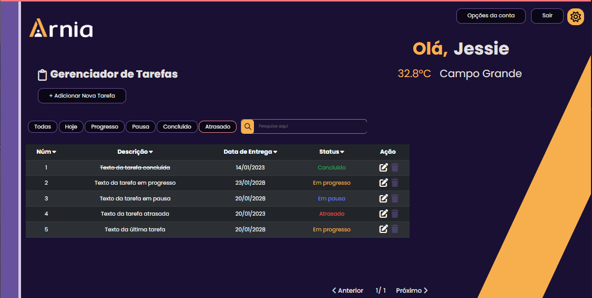
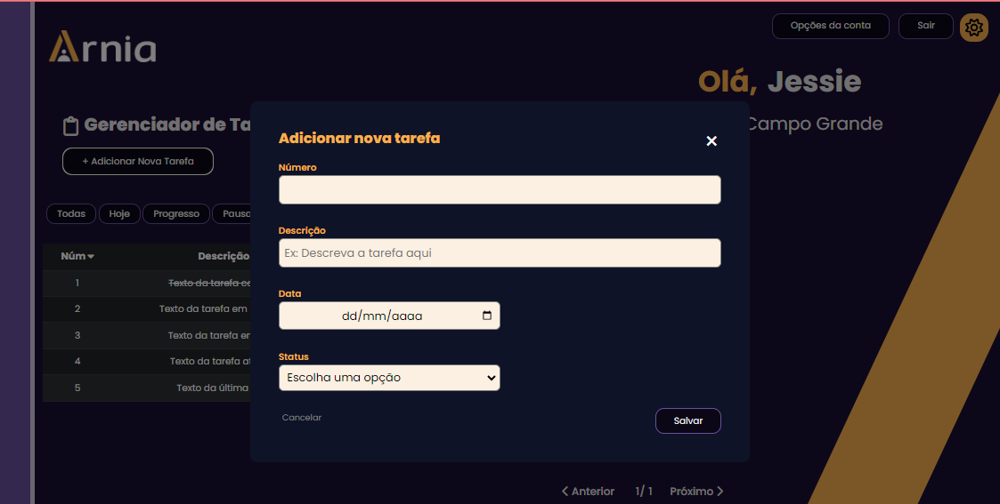
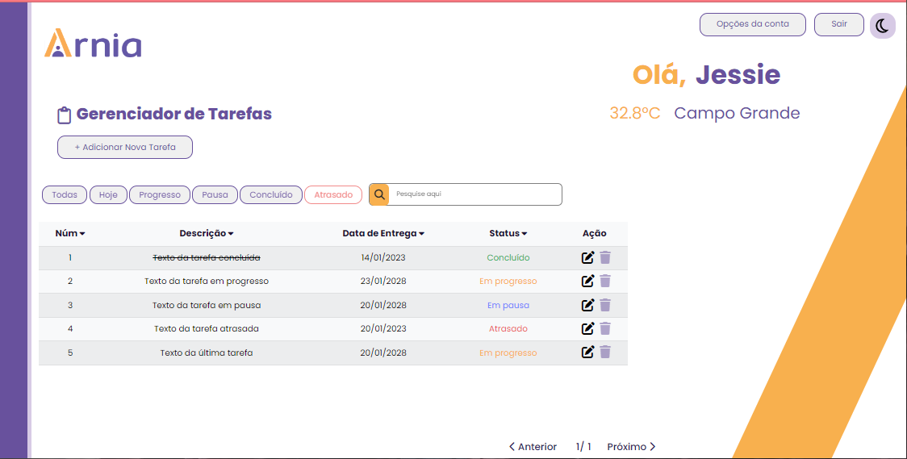
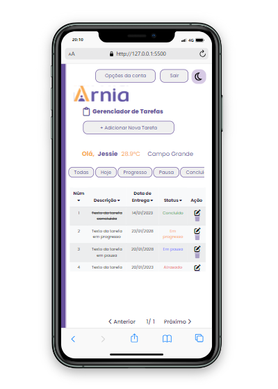

# Gerenciador de Tarefas Arnia ⏰📋📌

###### _Pssst! English version of this README is available [here](./EN_US.md)._



Bem-vindo ao **Arnia Task Manager!** Esta aplicação é uma ferramenta de gerenciamento de tarefas projetada para ajudar os usuários a criar, editar, concluir e excluir tarefas.

Seu principal objetivo é auxiliar na organização das atividades diárias e na priorização das tarefas conforme as necessidades individuais.

Este projeto foi o trabalho final da turma T32022 no primeiro módulo da formação da [Arnia - Escola de Programação]("https://arnia.com.br).

**Nome do Projeto:** Arnia Task Manager ⏰📋📌  
**Data de Início do Desenvolvimento:** 28/11/2022 ⏩  
**Data de Conclusão do Desenvolvimento:** 17/01/2023 🏁  
**Status:** Concluído ✅

🚀 **Link de Deploy:** [Vercel Deploy](https://first-module-jessie-moura.vercel.app/)

🎨 **Link para o Figma do projeto:** [Wexer Figma](<https://www.figma.com/design/KehBHfIEs2mnvSmlmHVVrH/M%C3%B3dulo-1-Atividade-Final-(Copy)?node-id=0-1&t=ouP9FhIhDBrEQtjk-0>)

📢 **ATUALIZAÇÃO 2024:** [Leia Mais](#leia-mais)

## Imagens do Projeto 📸

| Home Page                                                | Nova Tarefa                                          | Tema Claro                                              |
| -------------------------------------------------------- | ---------------------------------------------------- | ------------------------------------------------------- |
|  |  |  |

| Tema Claro Responsivo                                         | Tema Escuro Responsivo                                       |
| ------------------------------------------------------------- | ------------------------------------------------------------ |
|  |  |

## Tecnologias Utilizadas 🛠️

- **HTML5** para a estrutura da página
- **CSS3** para estilização
- **JavaScript** para interação com o usuário
- **Json-server** para simulação de API
- **Vercel** para deploy do projeto
- **Railway** para hospedagem da API

## Descrição do Projeto 📝

O **Arnia Task Manager** é uma aplicação web que oferece aos usuários a capacidade de criar, editar, marcar como concluídas e excluir tarefas, com a flexibilidade de alternar entre temas claro e escuro.

Receber esse desafio me motivou profundamente, pois estava em um estágio inicial de aprendizado em desenvolvimento web. Sou uma usuária fiel do [Notion](https://www.notion.so/) para manter minha vida e estudos organizados, e o conceito de CRUD, apesar de acadêmico, teve um grande impacto no meu aprendizado. Estou muito animada em compartilhar este projeto, que é uma expressão do meu progresso como desenvolvedora!

## **Principais Funcionalidades 🔧**

- **Criação e autenticação de usuários** 👤
- **Listar, criar, editar e excluir tarefas** 📋➕✏️🗑️
- **Marcar tarefas como _em progresso_, _em pausa_ e _concluídas_** ⏩⏸✅
- **Definir data e hora para as tarefas** ⏰
- **Status de 'Atrasado' para tarefas com o prazo vencido** ⏳❗
- **Alternância entre tema claro e escuro** 🌗
- **Exibição de informações climáticas** (em graus Celsius) ☁️

## Como Rodar o Projeto 🚀

1. Clone o repositório:
   ```bash
   git clone https://github.com/LadyJessie19/ArniaTaskManager.git
   ```
2. Abra o arquivo `index.html` no seu navegador.

3. Pronto! O projeto está rodando na sua máquina.

## Equipe de Desenvolvimento 🙋‍♀️


- **Desenvolvedora:** [Jessie Bentes](https://github.com/LadyJessie19)

## Como Contribuir 🆘

Se você deseja contribuir para o projeto, siga estes passos:

1. Faça um fork do projeto.
2. Crie uma nova branch:
   ```bash
   git checkout -b feature/nova-funcionalidade
   ```
3. Commit suas alterações:
   ```bash
   git commit -am 'Adicionei nova funcionalidade'
   ```
4. Faça o push para a branch:
   ```bash
   git push origin feature/nova-funcionalidade
   ```
5. Crie um novo Pull Request.

## Licença 🧐

Este projeto está licenciado sob a [Licença MIT](https://opensource.org/licenses/MIT).

## Bye 👋

Enquanto trabalho neste projeto, meu objetivo é entregar algo sólido e útil, que reflita o que aprendi até agora em minha jornada de desenvolvimento. Obrigada por dedicar seu tempo, e espero que você aprecie este projeto tanto quanto eu. 🚀

## Leia Mais

**ATENÇÃO!** Todos os dados e requisições do banco de dados foram mockados, então não é possível criar um usuário de fato. A API pode ser removida do ar ou o deploy pode ser desativado ao longo dos anos. Fiz isso para fins de demonstração. Deixei tudo da melhor maneira possível para que você possa testar o projeto. A situação das tarefas também está mockada, mas com o uso do Node.js, as tarefas criadas sem reiniciar a aplicação funcionarão corretamente. As tarefas podem ser excluídas e editadas como esperado.

Lembrando que desenvolvi este projeto com apenas três meses de aprendizado em programação. Ainda que longe do ideal em termos de boas práticas, código limpo e organizado, todos começamos em algum lugar. O que importa é onde podemos chegar. 😊

### Dados do Usuário Mockado:

```javascript
const user = {
  name: "Jessie",
  city: "Campo Grande",
  login: "jessica",
  email: "jessie@gmail.com",
  password: "123456",
  id: 1,
};
```

Para fazer login, use as seguintes credenciais:

```javascript
login: "jessica";
password: "123456";
```

---

## Vamos mudar o mundo com uma tarefa de cada vez! 🚀🥳
